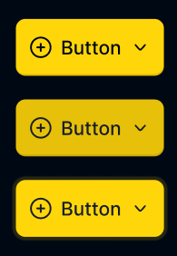
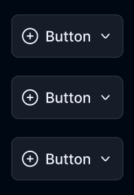
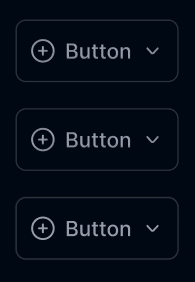
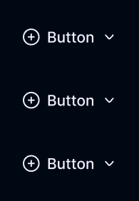

<h1>Buttons Preview</h1>

<h2>Primary Buttons</h2>
<code>type="primary"</code>

    

<h2>Secondary Button</h2>
<code>type="secondary"</code>

    

<h2>Border Button</h2>
<code>type="border"</code>

    

<h2>Outline Button</h2>
<code>type="outline"</code>

    

